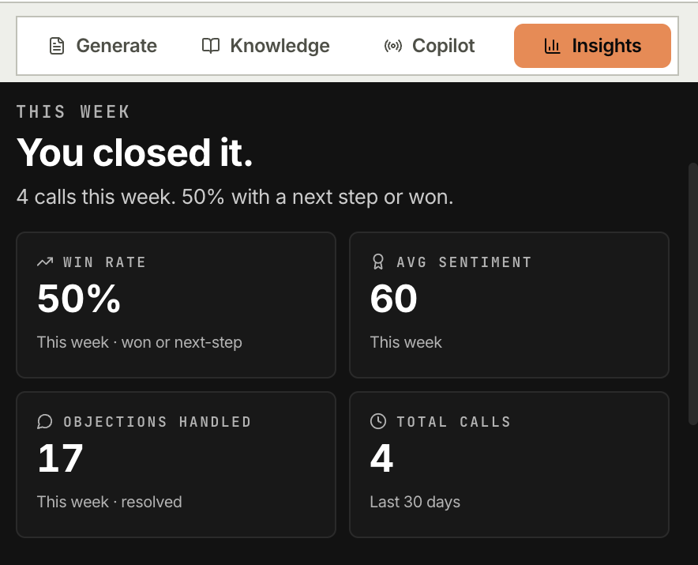
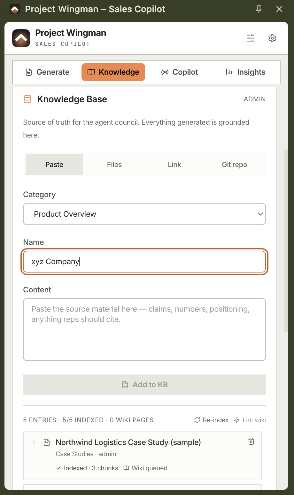
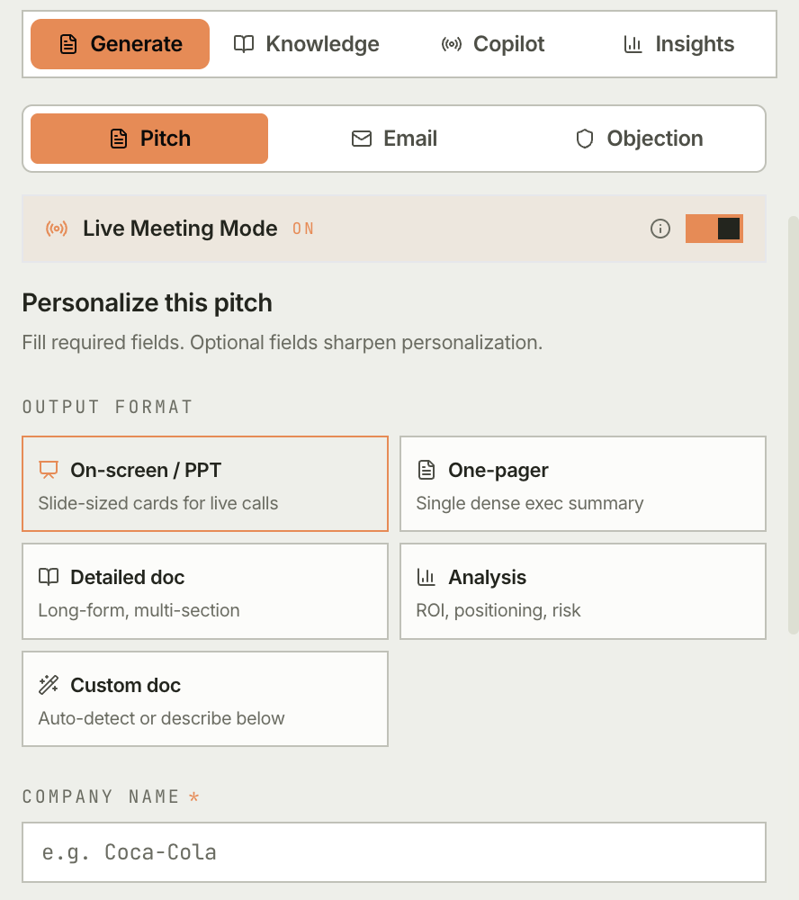
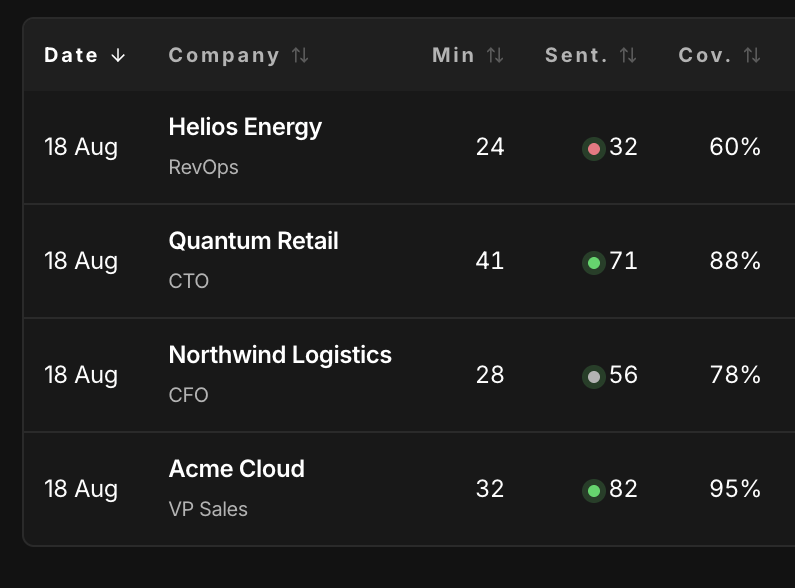

<div align="center">

# Project Wingman (ClientLens)

**The open-source AI sales copilot that lives in your browser sidebar.**

Live coaching during Google Meet calls, pitch generation grounded in your own knowledge base, and objection handling on tap. Runs on your LLM keys, on your infrastructure. There is no Wingman server.

[](LICENSE)
[](https://github.com/avinashgaurav/project-wingman/releases/tag/v1.0.0)
[](https://developer.chrome.com/docs/extensions/mv3/intro/)
[](https://react.dev)
[](https://vitejs.dev)
[](https://fastapi.tiangolo.com)
[](docs/configuration.md)

<br />



<sub>Insights after a week of calls. Every screenshot here is the real extension, with sample data loaded.</sub>

</div>

---

> [!IMPORTANT]
> **Authentication is not wired in v1.0.** The sidebar provisions a local admin and the backend runs with `DEV_MODE=true`, so **keep the backend off the public internet**. That is fine for the single-user, self-hosted case v1.0 targets, and not safe for a shared team deployment. Full posture: [Security model](docs/security.md).

## What it does

A sales rep's typical hour: jump into Google Meet, lose track of the agenda, fumble the objection, take a half-page of notes, paste them into the CRM, then forget the follow-up. Wingman compresses that loop.

- **Pre-call.** Generate a personalized pitch and a tailored email from the prospect's public signals and your indexed knowledge base.
- **During the call.** Five agents run on the live transcript: sentiment, agenda pacing, a coach that surfaces the next-best sentence, objection handling, and a validator that fact-checks numbers before you say them. A small overlay mirrors the cues on the Meet tab itself.
- **After the call.** A structured summary with agenda coverage, sentiment timeline, objections and action items. One click pushes it to Zoho CRM.

Everything is grounded: each numeric claim must cite a source from your knowledge base, and a dedicated validation agent rejects anything uncited.

### The loop, in screens

| | |
|---|---|
| **Load your material.** Case studies and battle cards, indexed and chunked. Every citation resolves back to one of these. |  |
| **Draft the pitch.** Five output formats and a buyer persona. Live meeting mode on for the call itself. |  |
| **Take the calls.** Each one lands with its sentiment and how much of the agenda you covered. |  |


**[Full feature detail →](docs/features.md)**

## What this is not, yet

Worth knowing before you invest an evening in it:

- **No Chrome Web Store listing.** Load unpacked. Setup is a developer task.
- **Authentication is not wired.** See the warning above.
- **Zoho is the only CRM**, and **Google Meet is the only meeting surface** that works end to end. HubSpot, Salesforce and Teams are on the roadmap.
- **Python 3.11+ is a hard requirement.** Dependencies resolve on 3.9, but the backend then fails at import, so it breaks later and more confusingly than you would expect.
- **No way to try it without installing it.** Mock mode avoids spending LLM credits but still routes through the backend, so there is no offline or hosted demo.

## Quick start

Prerequisites: Node 20+, Python 3.11+ (`brew install python@3.11`), a Supabase project (free tier is fine), and one LLM provider key.

> [!IMPORTANT]
> **On a new Gemini key, use `gemini-3.6-flash`.** Google has restricted the 1.5, 2.0 and 2.5 families to accounts that had already used them, so a key created today returns `404 no longer available to new users` on those, and they do not appear in the API's own model list either. `gemini-3.6-flash` works and is the default here. Groq and OpenRouter are the alternatives if you would rather not use Google at all.

```bash
git clone https://github.com/avinashgaurav/project-wingman.git
cd project-wingman

bash scripts/setup_env.sh          # writes backend/.env and extension/.env

cd backend && python3.11 -m venv venv && source venv/bin/activate
pip install -r requirements.txt
uvicorn main:app --reload --port 8000     # health check: curl localhost:8000/health

cd ../extension && npm install && npm run dev
```

`npm run dev` is a watch build (`vite build --watch`), so it does not exit. Leave it
running and open a second terminal for anything else.

Then load `extension/dist/` at `chrome://extensions` with Developer mode on, and click the extension icon. **There is no sign-in step**: the panel opens straight into an admin session.

> [!NOTE]
> **You never hand-edit `extension/manifest.json`.** It is a template with two deliberate placeholders. The build injects your OAuth client ID and backend host from `.env` into `extension/dist/manifest.json`. A production build fails if the backend host is unresolved, and warns if the client ID is missing (that one is optional: only Google Slides/Drive export and Calendar sync read it).
>
> **Use `npm run dev`, not `npm run build`.** Self-hosting v1.0 against a local backend is the supported shape, and only the dev build may reach `localhost`. A release build requires a public https backend, which is not safe to expose until authentication is wired. [The two build modes](docs/development.md#the-two-build-modes-and-which-one-you-want) explains why.

**[Every config variable →](docs/configuration.md)** · **[Development guide →](docs/development.md)**

## Documentation

| | |
|---|---|
| [Features in detail](docs/features.md) | Pitch council, live copilot, objection composer, email council, KB and RAG, ICP profiles, RBAC |
| [Architecture](docs/architecture.md) | How the pieces fit, and the full project layout |
| [Configuration](docs/configuration.md) | Both `.env` files, token budgets, the `tabCapture` permission edge case |
| [Development guide](docs/development.md) | Mock mode, checks, releasing, regenerating brand assets |
| [Security model](docs/security.md) | Auth posture, host permissions, what to lock down before deploying |
| [Contributing](CONTRIBUTING.md) | Setup, PR expectations, and what I will probably say no to |

## Tech stack

**Extension:** React 18, TypeScript 5, Tailwind 3, Zustand, Chrome MV3 (service worker, Offscreen API, AudioWorklet), built with Vite 8.

**Backend:** FastAPI and Pydantic v2 on Python 3.11, Supabase Postgres with RLS, Pinecone or an in-browser HNSW vector store, Deepgram Nova-2 for speech.

**LLMs:** Anthropic, Gemini, Groq, OpenRouter, or any OpenAI-compatible endpoint. The extension never holds a provider key; the backend proxies.

## Roadmap

1. **Wire real authentication.** Everything else is downstream of this: it is what gates a shared team deployment.
2. Salesforce and HubSpot connectors, Microsoft Teams copilot.
3. On-device STT (Whisper) for privacy-sensitive deployments.
4. Multi-tenant mode with org-level KB isolation.
5. A zero-setup way to try it. Mock mode still needs the backend running, so today there is no way to see the UI without a full install.

The backlog with acceptance criteria lives in [#113](https://github.com/avinashgaurav/project-wingman/issues/113). Items are largely independent, so pick any of them in any order.

## Contributing

PRs welcome, including small ones. [**CONTRIBUTING.md**](CONTRIBUTING.md) covers setup and expectations. CI runs these on every PR, and running them first saves you a round trip:

```bash
cd extension && npm run type-check && npm run lint && npm run dev
cd .. && bash scripts/lint-manifest.sh
```

Use `npm run dev` here, not `npm run build`. A production build refuses a
`localhost` backend by design, so on a normal self-hosted setup `npm run build`
is *supposed* to fail. There are no tests yet, which is why CI checks types,
lint, the build and the generated manifest rather than behaviour.

Setup failures are real bugs and among the most useful reports, since the self-hosted path gets exercised on far fewer machines than it should. Questions that are not bugs belong in [Discussions](https://github.com/avinashgaurav/project-wingman/discussions). **Security issues: do not open a public issue**, use a [private advisory](https://github.com/avinashgaurav/project-wingman/security/advisories/new).

## License

[MIT](LICENSE) © 2026 Avinash Gaurav.

Free to use, modify and distribute. Bring-your-own-keys means you run it on your own provider accounts: there is no Wingman-hosted service and no telemetry.
