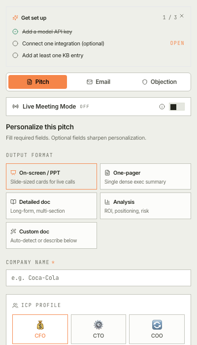
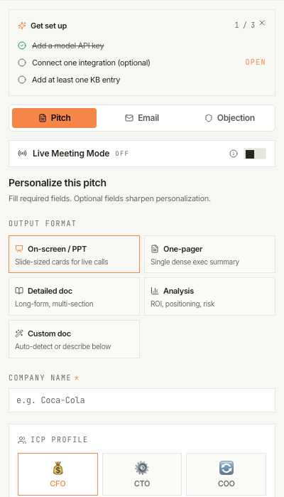
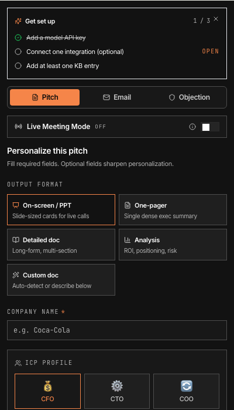

# #87 — Cross-skin consistency audit

**Status:** investigation, no code change yet. Decision needed before implementation.

## TL;DR

PR #40 introduced 6 skins (`brand` / `live` / `insights` for the sidebar; `linear` for the popup; `vercel` for the in-Meet transponder; `spacex` for the landing hero). Side-by-side audit findings:

| Skin | Surface | Verdict |
|---|---|---|
| brand | Sidebar — Generate / Knowledge | **Keep** |
| live | Sidebar — Copilot tab | **Harmonize** (effectively the same canvas as `brand` for shared content; only the Cursor timeline pastels are skin-distinct) |
| insights | Sidebar — Insights tab | **Keep** (the Spotify dark canvas is load-bearing for the album-grid metaphor) |
| linear | Popup | **Harmonize → adopt `brand` skin** (the visual distinction is subtle and not load-bearing) |
| vercel | In-Meet transponder | **Keep** (mono palette is intentional non-competition with Meet UI; #81 added the one brand cue) |
| spacex | Landing hero | **Keep** (marketing surface, intentional contrast) |

**Net recommendation: drop `linear` (use `brand` for the popup) and harmonize `live` so it diverges from `brand` only where the timeline pastels actually need to differ.** 4 skins instead of 6, no perceived loss for the rep.

## Audit method

Built `extension/dist/`, served over HTTP, and screenshot each surface at a consistent viewport (sidebar at 400×800, popup at 400×800, landing hero at 1280×900). The `vercel` transponder injects into a live Meet DOM and could not be standalone-rendered; described verbally below using its CSS source.

For the sidebar, I forced the inner `data-skin` attribute to each value via DOM manipulation so the same Generate-form content rendered under all three sidebar skins. This isolates the skin-driven visual difference from the content-driven one.

## Surface-by-surface

### `brand` (default sidebar)

Warm-cream canvas (`--surface-0: #EEEFE9`), white cards on cream (`--surface-1: #FFFFFF`), olive-charcoal ink. Designed as the PostHog-lineage default. Orange CTA pops. Eyebrows uppercase + mono. Pastel callout colors for non-CTA accents.

**Verdict: keep.** This is the workhorse skin for half the surfaces.

### `live` (sidebar Copilot tab)

When the same content renders under `live` vs `brand`, the two are **visually near-identical**. Both use warm-cream surfaces, near-black ink, the same orange CTA. The token differences (`--surface-0: #F7F7F4` vs `#EEEFE9`, `--ink-3: #5A5852` vs `#4D4F46`) are below perceivable threshold on a 400px sidebar at typical brightness.

The intentional skin-distinct element is the Cursor timeline pastel palette (`--timeline-thinking: #DFA88F`, `--timeline-grep: #9FC9A2`, etc.) used by the live-agent sub-component. That palette is only used during a live Meeting Copilot session — it doesn't render on the form. So when a rep flips between Generate and Copilot tabs **before** a session starts, the visual difference is functionally zero.

**Verdict: harmonize.** Two paths:
1. **Drop `live` entirely.** Merge the timeline pastels into `brand`'s tokens (gated under a `.timeline-*` class scope, not by `data-skin`). One fewer skin.
2. **Keep `live` for semantic clarity but converge the base palette with `brand`.** Same hex values for `surface-*` and `ink-*`; only the timeline pastels remain skin-unique.

Both produce the same visual outcome. (2) preserves the mental model "this tab is the Live Copilot" via the data-skin attribute; (1) is simpler but removes that signal.

### `insights` (sidebar Insights tab)

Near-black ladder (`--surface-0: #121212` through `--surface-4: #272727`), white text, Spotify green as functional signal. Heavy contrast with `brand`/`live` — when the rep flips into Insights, the canvas going dark is an immediate cue "this is a different mode."

The screenshot above forces the Generate form into this skin. The form fields still work but look "off" — they were designed for cream surfaces, the dark canvas makes them feel like dropped-in widgets. **This is by design**: real Insights content is the album-grid + call tiles, which fit the dark canvas natively. The screenshot is the worst-case mismatched-content view; real usage doesn't show it.

**Verdict: keep.** The Spotify dark is load-bearing for the album-grid metaphor and gives Insights a distinct mental room.

### `linear` (popup)

Two large nav rows ("Open Sales Copilot" / "This week's insights") on a near-black canvas, mono tagline below. The popup is a launcher, not a full surface — its job is to dispatch the rep into the sidebar.

Compared to `insights`: visually almost the same dark canvas + orange CTA + light text. The differences (`--surface-0: #010102` vs `#121212`, `--line: #23252A` vs `#4D4D4D`) are nearly imperceptible at this density.

The popup never shares a screen with the sidebar — clicking the toolbar icon opens the popup, the rep clicks a button, the popup closes and the sidebar opens. So "consistency" between popup and sidebar is theoretical, not lived.

**Verdict: harmonize → adopt `brand` skin**, or drop the popup skin distinction entirely. Two arguments:

- **Adopt `brand`:** the popup becomes cream-canvas like the default sidebar. Visually warmer, on-brand with the workhorse skin. Argument against: the popup-as-launcher is a *brief* moment (most reps see it for <2 seconds), so visual delight is less valuable than mental cohesion with the surface they're heading to.
- **Drop the distinction (default skin = no `data-skin` attribute):** popup falls through to the `:root` defaults (which are equivalent to `brand`). One fewer skin block in `tokens.css`, less to maintain.

Either path achieves the audit goal: remove `linear` as a distinct skin.

### `vercel` (in-Meet transponder)

Not screenshotted — the transponder injects into Meet's DOM and can't render standalone. Per `extension/src/content/meet-transponder.ts`:

- Pure black canvas (`#000000` background, `#FFFFFF` text)
- Single brand cue: pulsing orange status dot (#81, just landed)
- Outer shell uses Helvetica/Inter; everything is intentionally mono-flavored
- Pacing chips, transcript drawer, KB-ask input — all white-on-black

**Verdict: keep.** The vercel mono palette is intentional non-competition with Meet's own UI. Adding any chromatic noise risks visual clutter inside Meet's busy chrome. #81 added the one brand cue (the dot) which gives Wingman a recognizable signature without breaking the neutrality contract.

### `spacex` (landing hero)

Pure black, full-bleed marketing surface, single orange ghost-pill CTA. The landing page (post-#77) uses this only for the hero band; subsequent bands carry their own surface designs (the comparison table is dark, pricing is black, etc.).

This skin lives in the static landing's CSS, not in `tokens.css`. It's not consumed by any extension surface. So the audit question doesn't really apply — it's a marketing-page choice.

**Verdict: keep, out of scope.** The landing page is a separate property; its visual choices are decoupled from the extension's skin system.

## Proposed changes

If approved:

1. **Drop `linear` skin from `tokens.css`.** Popup uses the default (= `brand`) skin. Saves ~30 lines of token CSS, removes one mental model.
2. **Converge `live` base tokens with `brand`.** Keep `live` as a `data-skin` value (for semantic clarity in the Copilot tab DOM) but copy `brand`'s `surface-*` and `ink-*` values into the `live` block. Only the timeline pastels remain skin-unique.
3. **No change** to `brand`, `insights`, `vercel`, or `spacex`.

Net effect:
- Skins remaining as distinct visual surfaces: 4 (`brand`/`live` look the same outside the timeline; `insights` dark; `vercel` transponder mono; `spacex` landing hero).
- Skins distinct in code: 5 (`brand`, `live`, `insights`, `vercel`, `spacex`).

## Sub-issues to file if approved

1. **`UX: drop linear skin — popup adopts brand`** (~0.5 day). Touches `tokens.css` (delete linear block), `popup/main.tsx` (remove `data-skin="linear"`), verify popup renders identically to a `brand`-skin'd surface.
2. **`UX: converge live base tokens with brand; keep timeline pastels`** (~0.5 day). Touches `tokens.css` only. Visual diff before/after should be near-zero outside the live coach component.

## Out of scope
- Redesigning the design system (token names, ladder counts).
- Adding new skins.
- Changes to `brand`, `insights`, `vercel`, `spacex` themselves.
- Landing-page restyling (separate property).

## Open question for the user

The audit's central finding is that `live` and `brand` look the same on shared content. The recommendation above keeps `live` as a semantic label (with the timeline pastels as its only skin-distinct feature). Alternative: drop `live` entirely, fold the timeline pastels into a `.cursor-timeline` class scope. Which is preferred — keep `live` as a semantic surface marker, or simplify to one skin (`brand`) for the whole sidebar?
